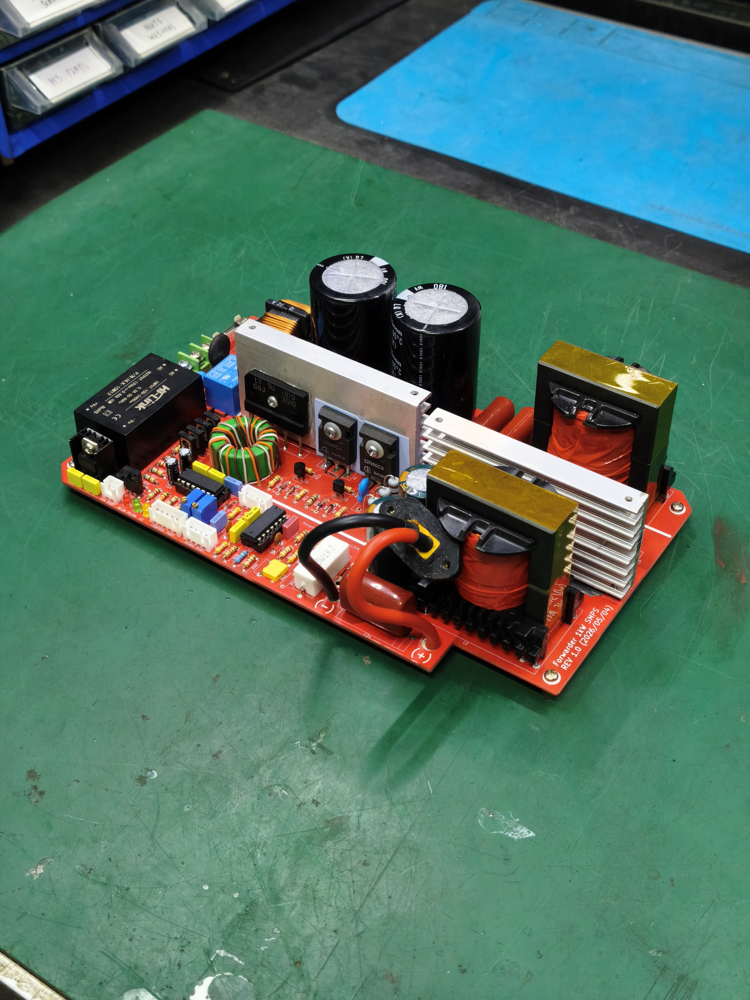
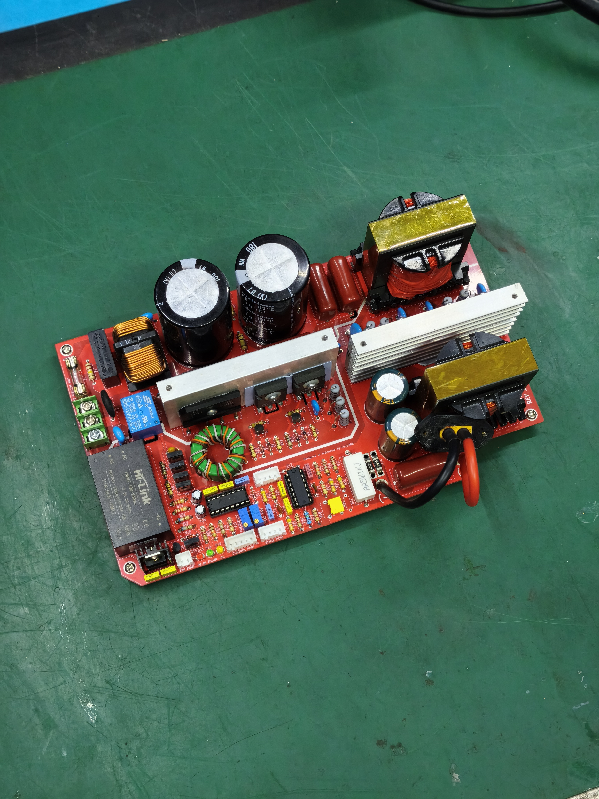

# Forwarder 1kW

The Forwarder 1kW is a custom-designed power supply module engineered as a cost-effective, simple, and reliable solution for your DIY lab bench power supply build. It features 1kW maximum continuous output, configurable output voltage/current, extensive interfaces for control and monitoring, and more.

<table>
<tr>
<td></td>
<td></td>
</tr>
</table>

## Key features:
* 1000W maximum continuous output capacity.
* Configurable from 40V/25A up to 400V/2.5A.
* CC/CV mode with mode signal and indicator.
* Tuneable operating frequency and dead-time.
* Dedicated power stage enable pin.
* Analog reference interface for output voltage/current control.
* Analog signal output interface for monitoring voltage/current.
* Dedicated fan port with optional automatic power-on.
* Simple construction, less than 130 components on board.
* Easy to build with mostly THT components.
* Curated component selection for high accessibility.

## Other Resources:
* YouTube guide video: https://youtu.be/MGMqqtXgwRg
* Reddit thread: https://reddit.com/r/electronics/comments/1uf93w4/ 
* Spreadsheet calculation & bill of materials: https://docs.google.com/spreadsheets/d/1iN1n8ODkl2QElmMIK3gC6hOZOITUpqSsXAw9wtJAFAA/

## Creator's Note
* If you decided to create one, please let me know! I'd love to see builds by other people and I may feature yours.
* You can monetarily support my project at https://www.paypal.com/paypalme/1308luq or Indonesian QRIS: https://drive.google.com/file/d/1ByYom3lGI_URLXFeYIVnVDYlewzsi3qb/
* Feel free to reach out to me for support, regardless of your donation status. I'd be more than happy to help.

## Project Documentation

The Forwarder 1kW is a switch mode power supply board based on a half-bridge topology. It's based on SG3525 + LM324 for the control circuit and features many functions.

The power supply is designed to operate within 190-240 volts AC. If you live in places where the mains is half of that, you might be able to get away by reconfiguring the input rectifier circuit into a voltage doubler and you have to do the modification yourself.

The board features extensive interfaces. The pins along with their functions are as follow:

FAN PORT (OUTPUT): 12V fan with a low-side switch, 500mA load limit.

CONTROL PORT: To control the main functions of the board.
* PS_EN = Power stage enable pin (INPUT, normally 3V, low enable)
* FAN_EN = Fan enable pin (INPUT, normally 5V, low enable)
* CC_IND = Constant current mode indicator (OUTPUT, 0V = CV, 3.6V = CC)

SENSE PORT (OUTPUT): Outputs 0 - 2.5 volts analog signal of the output voltage and current.

VREF PORT (INPUT): Takes 0 - 2.5 volts analog signal to set the output voltage and current.

You can choose to solder or omit D16. Solder D16 if you want the fan to turn on with the power stage. If you do this, use the pin FAN_EN to enable or disable both the power stage and fan (using the PS_EN will not turn on the fan!). Omit D16 if you have an external microcontroller that controls the fan automatically over FAN_EN.

You can short R41 and R42 if your output voltage is less than 200V and use only single resistor for each. Otherwise, spread the voltage stress across 2 resistors in series.

For high-current applications and you need more precise regulation, you can implement external voltage sensing by breaking JP1 and soldering a sensing wire to the EX_VSENS pad.

The heatsink must be spaced from the board. Use a metal M3 screw, an M3 nylon nut between the heatsink and the board, and a TO-220 washer ring on the bigger hole to better insulate it.
